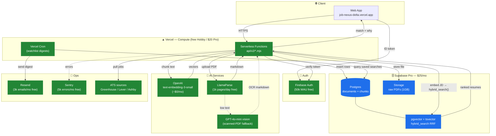
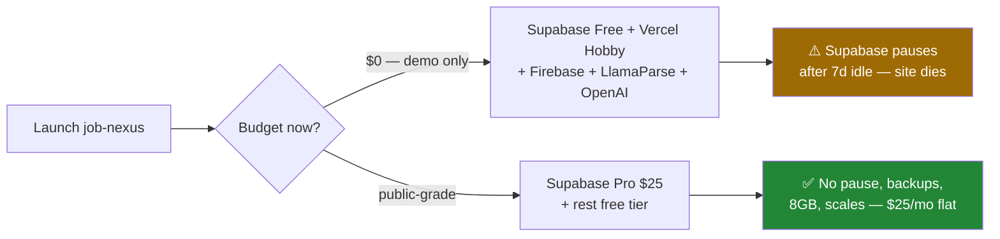

# Job Nexus — Free/Cheap Stack (Post-Azure)

Target: move off Azure (VM + Cosmos + AI Search) → serverless free/cheap stack for public launch.
**Fixed cost: $25/mo** (Supabase Pro) vs Azure ~$130–200/mo. Everything else free tier.

---

## Architecture + data flow

🟦 = the one fixed cost (Supabase Pro, $25/mo) 🟩 = free tier

---

## Cost table

| Need | Pick | Free tier | When you pay |
|:---|:---|:---|:---|
| Compute / API | **Vercel** | 100GB-hr, 100k calls/mo | Pro $20 past traffic |
| DB + vectors | **Supabase** | 500MB, pauses 7d idle | **Pro $25/mo** (no pause) |
| Embeddings | **OpenAI `text-embedding-3-small`** | — | ~$0.02/1M tokens (≈$0/mo) |
| PDF parse | **LlamaParse** | 1k pages/day | past 1k/day |
| Parse fallback | **GPT-4o-mini vision** | — | pennies per scanned PDF |
| Auth | **Firebase Auth** | 50k MAU | rarely hit |
| File storage | **Supabase Storage** | 1GB | in Pro |
| Email | **Resend** | 3k/mo, 100/day | past that |
| Cron | **Vercel Cron** | free any plan | — |
| Monitoring | **Sentry** | 5k errors/mo | past that |
| Domain | Namecheap / Cloudflare | — | ~$10/yr |

---

## Two launch paths

**Alt for true $0 no-pause:** swap Supabase → **Neon** (free Postgres + pgvector, no pause), wire Supabase Storage or Vercel Blob separately for files. More glue, $0. Upgrade to Supabase Pro when ready.

---

## Replaces (Azure → here)

| Azure (old) | Free/cheap (new) |
|:---|:---|
| VM Flask `app.py` | Vercel Functions |
| Cosmos DB | Supabase Postgres |
| AI Search (~$75/mo) | pgvector + RRF (in Postgres) |
| Document Intelligence | LlamaParse + GPT-4o-mini |
| Container Registry | gone |
